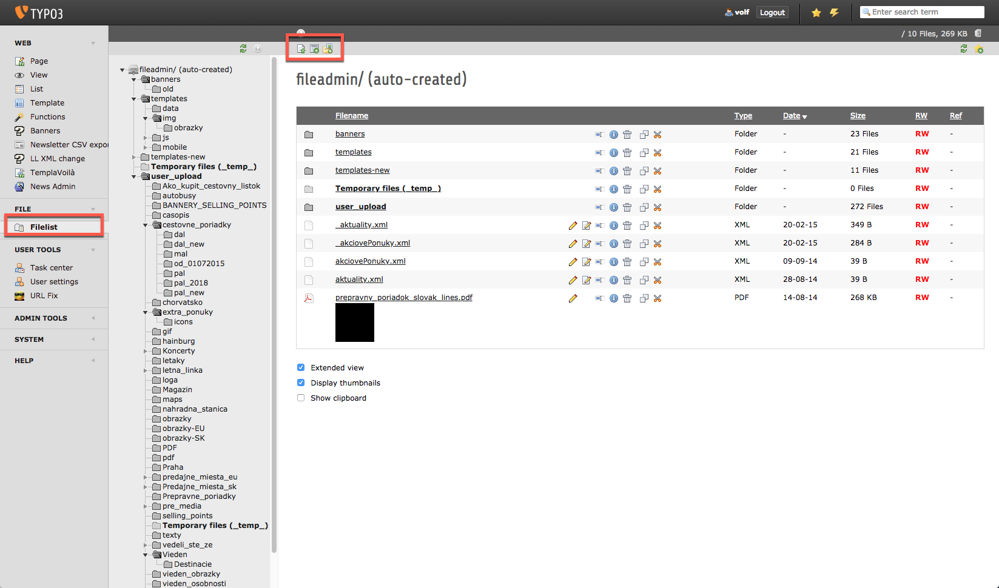
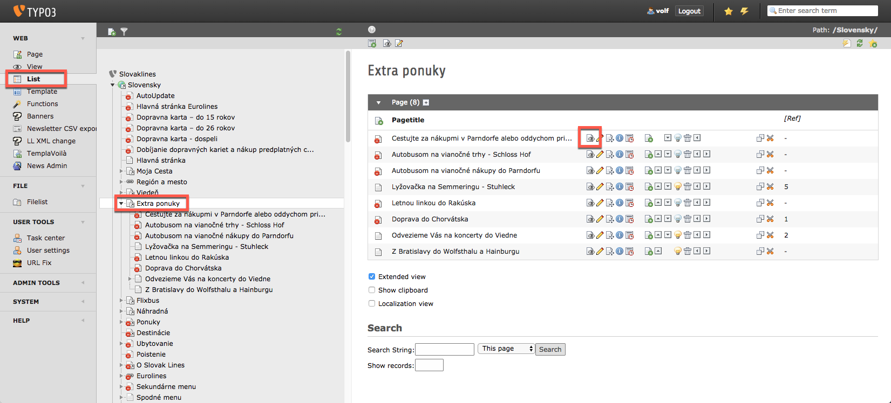
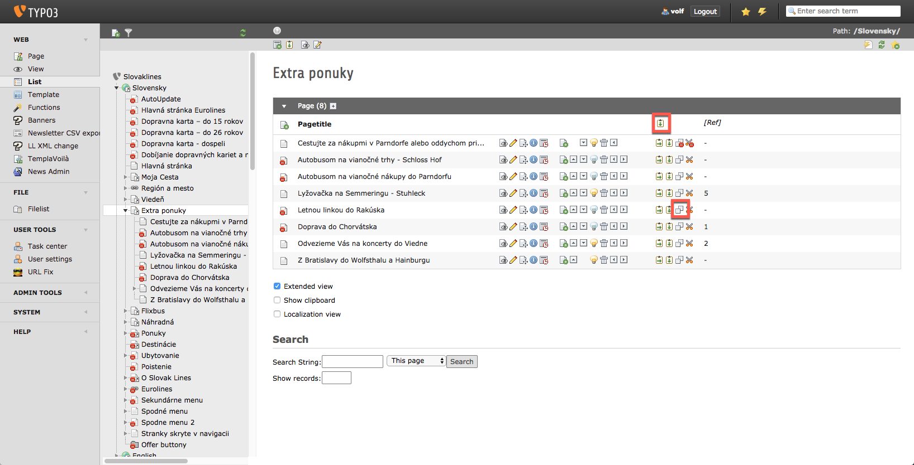
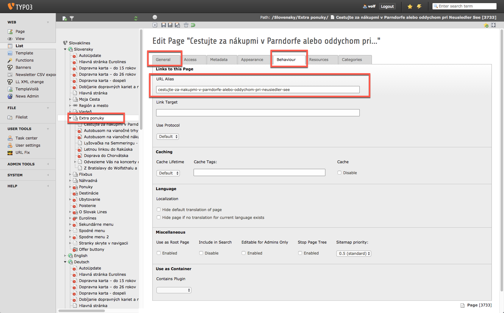
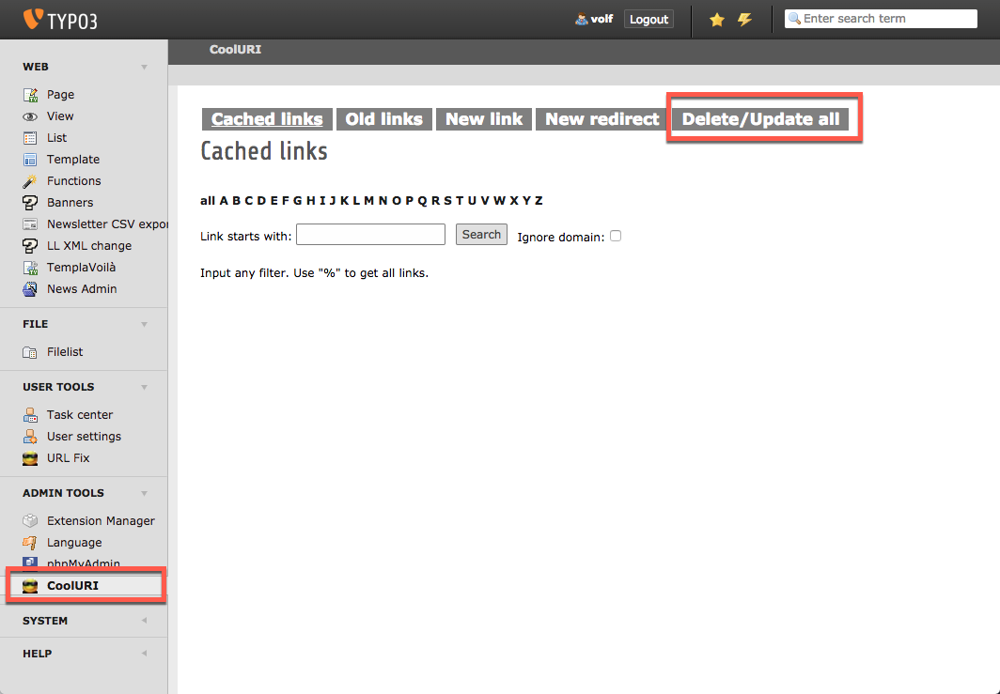
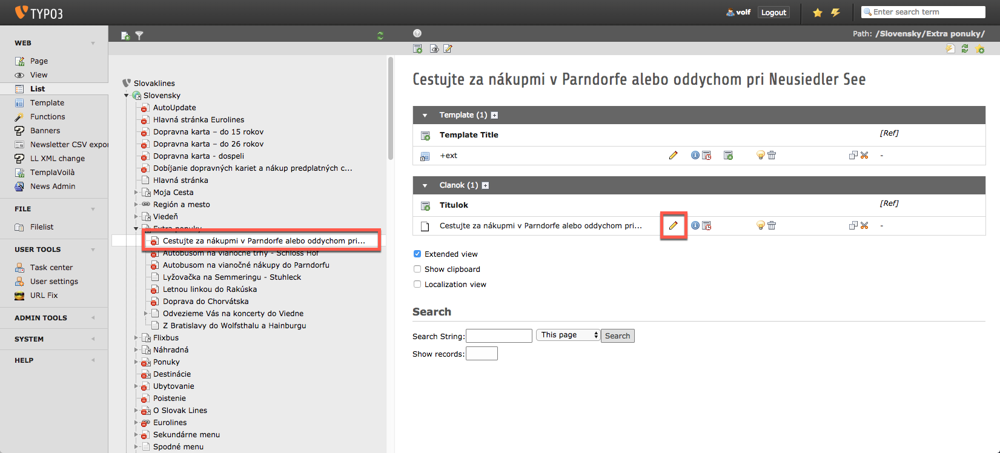
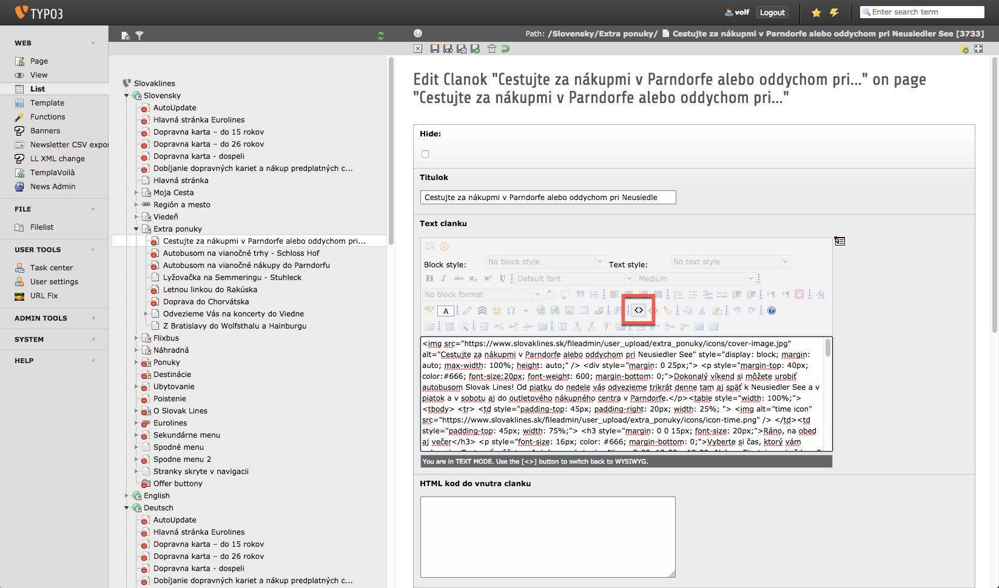

# slovaklines-contents

Static html content templates for Typo3.

## What is it for'?'

When we need to create a new content page for Slovaklines' Typo3, it will help to develop and test new page locally without loosing your head about Typo3's text editor. You can find some created page and a template for that. Typo3's text editor only accept ::minified html:: and in most cases we need to write inline css too! In these templates we load neccessary layout and css files, classes from Slovaklines theme, so we can see locally what will do in slovaklines.sk.

## How can I use it'?'

### Editing html files

Duplicate an existing content page or just start from template file. You only need to edit between two html comment tags.
Here are some tips:

- For styling please don't use css classes (except from Slovaklines theme); write only inline css.
- Avoid using floats, flex, css-grid and other fancy css layout things, use only normal `
`, `
`, `` and `<table>` tags only. Yes, you need to use tables to align items next to each other (editors at Slovaklines demand for it)

You should upload all images to Typo3 file system and use their full absolute src URL here:

You can upload new files with icons above, afterward click on an image (you need to click parent folder on file tree) to open it and copy it's URL.

When you are done, copy your content code between two html comment tags and minify that with a minifier like: [https://www.willpeavy.com/minifier/](https://www.willpeavy.com/minifier/)

Copy minified code to pasteboard and navigate to slovaklines's typo3 backend (see below).

### Live reload locally

For easier local developing you can use live server for auto reload after each file saves. However you can setup gulp.js + browsersync for that, but I think the easiest way for that a code editor extension. For example for **Visual Studio Code** you can use [LiveServer](https://marketplace.visualstudio.com/items?itemName=ritwickdey.LiveServer). When you run server, it will open that in your default browser. Place two windows next to each other and you can see immediately every changes after file saving.

### Import to Typo

Login to typo here: [Typo3](https://www.slovaklines.sk/typo3). _WARNING:_ after some idle time it will show a login/logout prompt window, you must choose logout and relogin to typo3 because security token issues.

In the most left sidebar choose **List** below WEB and search your target page's parent folder in the file navigation tree:

Here you can open it for preview (see eye icon on image above) for exist ones. But here you can create a new one too. Recommend to duplicate an existing one: copy icon then paste icon above:

If you create/duplicate a new page don't forget to set up title and a valid and unque URL Alias for that: click on edit button than _General_ tab for title and _Behaviour_ for URL Alias:

If you have to chang alias URL later, it won't update. To do that please use CoolURI from left sidebar's admin tools:

For other cache issues, use the flash icon in the top most bar.

For edit page content please click on page in the file navigation tree to open it and choose edit icon next to below block:

Afterthat use code icon for source code and replace it:

